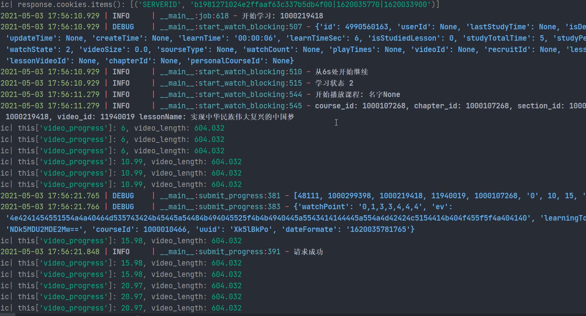

<h1 align="center">zhihuishu-cli</h1>

> 一个`智慧树`(`知到app`)的终端接口
>
> a command line interface of `zhihuishu`(`zhidao app`)

你想要在终端上学习`智慧树`(`知道app`)吗?

或者是你想要在服务器上"签到学习"`智慧树`(`知道app`)上的课程吗?

**`zhihuishu-cli`满足你**

你只需要简单的学习一下使用教程, 然后就可以在终端"学习"`智慧树`(`知道app`)上的课程了

## 快速上手(QuickStart)

> 无

### 首先clone本仓库
```shell
git clone www.github.com/notnotype/zhihuishu-cli.git
```

### 然后进入此目录
```shell
cd zhihuishu-cli
```

### 安装项目依赖
> 你必须提前安装好python环境, 然后安装python模块
```shell
pip3 install -r requirements.txt
```

### 运行脚本

> 本项目处于开发状态, 并不支持配置课程, 但可以看个效果
 
```shell
python3 main.py
```

---

### 然后你将看到一个二维码弹出

> 如果没有弹出则说明你没有使用窗口界面
>
> 二维码图片在项目目录下 `/qrcode.jpg`

使用手机`知道app`扫码即可

## 运行截图



## 一些废话

本仓库还处于开发状态, 不要以为这就是最终形态了啊!

如果那一天突然用不了了绝大可能是`智慧树`网站的原因, 不要怪我啊, (绝对不是我的错QAQ

开玩笑的, 用不了了请提出一个issue, 如果有pr就更好! 如果我有时间会进行维护的(虽然可能性很小(逃
