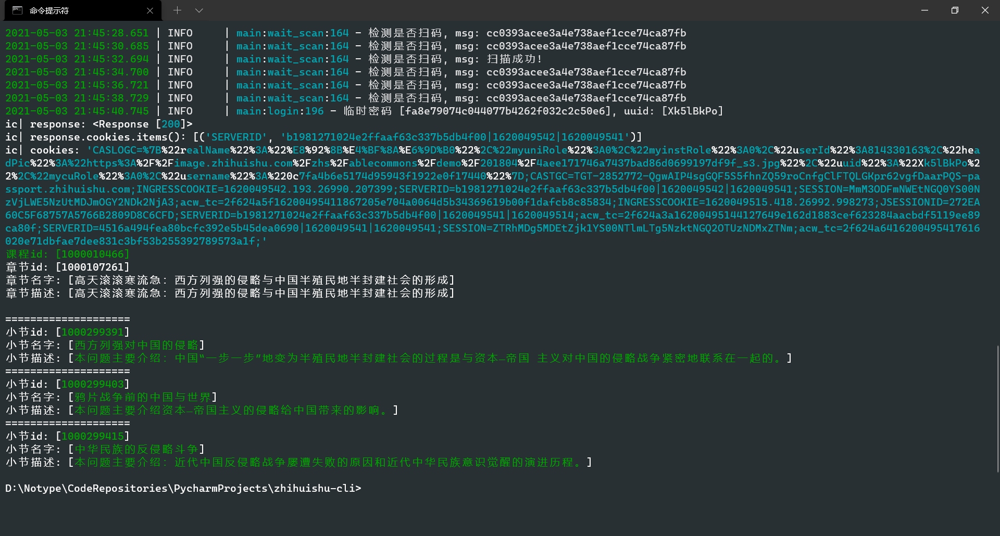
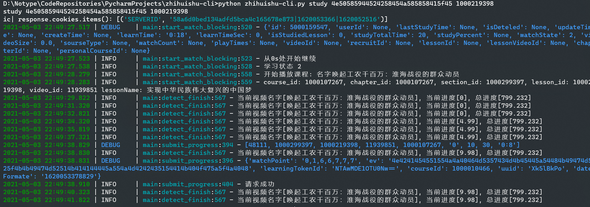

<h1 align="center">zhihuishu-cli</h1>

> 一个`智慧树`(`知到app`)的终端接口
>
> a command line interface of `zhihuishu`(`zhidao app`)

你想要在终端上学习`智慧树`(`知道app`)吗?

或者是你想要在服务器上"签到学习"`智慧树`(`知道app`)上的课程吗?

**`zhihuishu-cli`满足你**

你只需要简单的学习一下使用教程, 然后就可以在终端"学习"`智慧树`(`知道app`)上的课程了

## 快速上手(QuickStart)

### clone项目安装

```shell
git clone https://www.github.com/notnotype/zhihuishu-cli.git
cd zhihuishu-cli
pip install -r requirements.txt
```

### 过滑动验证

```shell
python zhihuishu-cli.py auth
```

该操作会打开浏览器（chrome浏览器）获取token，然后在`.zhihuishurc`文件中填入`token`字段

### 获取共享课程

```shell
python zhihuishu-cli.py share-course
```

### 获取章节列表

```shell
python zhihuishu-cli.py chapters 4e50585944524258454a585858415f45
```

### 获取小节列表

```shell
python zhihuishu-cli.py sections 4e50585944524258454a585858415f45 1000107271
```

### 获取小课程列表

```shell
python zhihuishu-cli.py lessons 4e50585944524258454a585858415f45 1000107271 1000299421
```

### 开始学习

```shell
python zhihuishu-cli.py study 4e50585944524258454a585858415f45 1000219410
```

### 每天自动学习

> 默认为每天21点自动打开二维码认证

```shell
python zhihuishu-cli.py run_course 4e50585944524258454a585858415f45
```

### 使用mirai部署

> 先配置mirai-api-http
>
> 然后将一些mirai-api-http配置信息填入`/mirai/mirai.config.json`里面
>
> 模板文件在`/mirai/mirai.config.template.json`

```shell
python zhihuishu-cli.py deploy-mirai 4e50585944524258454a585858415f45
``` 

### 获取帮助信息

```shell
python zhihuishu-cli.py --help
```

### 自定义部署

```shell
python zhihuishu-cli.py deploy test:Test 4e50585944524258454a585858415f45 -c 3
```

新建一个文件继承 `ZhiHuiShuCourseWorkerBlocking` 类, 可以覆写以下方法

- course_start 创建调度器之前, (输入命令后)
- course_end 创建调度器之后, (已经完成这门课程)
- job_start 调度时间到 (开始今天的任务)
- job_finish 调度完成 (今天的任务完成啦)
- before_qr 在弹出二维码之前
- after_qrcode 在扫描二维码之后
- lesson_finish 看完一个视频后

### 第一次使用, 或者长时间未使用会弹出二维码进行认证

> 如果没有弹出则说明你没有使用窗口界面
>
> 二维码图片在项目目录下 `/qrcode.jpg`

使用手机`知道app`扫码即可

## `.zhihuishurc`文件说明

- `datetime`: 上次登录时间

- `token`: 条形验证token

- `cookies`: 网站cookies

## 其他说明

### 删除`.zhihuishurc`文件即可清除本地cookie

- 二维码120s后过期

- 运行截图

- 运行 `python zhihuishu-cli.py --help` 查看帮助






## 一些废话

本仓库还处于开发状态, 不要以为这就是最终形态了啊!

如果那一天突然用不了了绝大可能是`智慧树`网站的原因, 不要怪我啊, (绝对不是我的错QAQ

开玩笑的, 用不了了请提出一个issue, 如果有pr就更好! 如果我有时间会进行维护的(虽然可能性很小(逃
